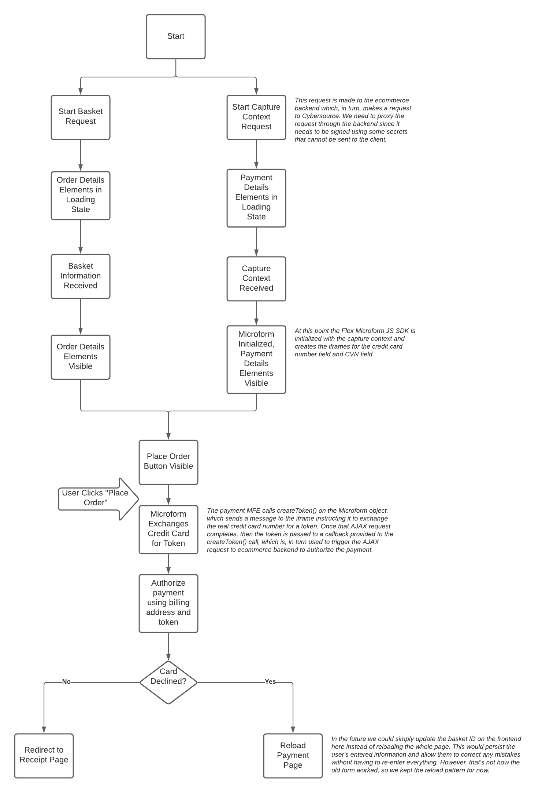
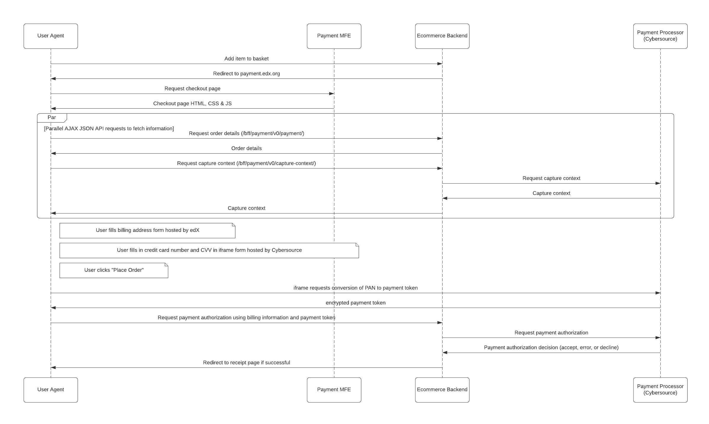

4. iFrame Credit Card Handling
------------------------------

Status
------

Accepted

Context
-------

Credit card numbers and security codes are very sensitive classes of data. They are closely protected by the Payment Card Industry Data Security Standard (PCI DSS). For merchants to process credit cards they must be compliant with this standard. Unless transactions volumes are very high, the PCI DSS does not require an external certification, instead requiring merchants to complete a Self-Assessment Questionnaire (SAQ). The simplest version of this questionnaire is only applicable if the merchant completely outsources the handling, storage and processing of the sensitive credit card data to a PCI compliant vendor. This requires the vendor hosting all data entry elements. A common practice used by payment vendors is to offer an iframe integration where the merchant controls the checkout experience, however, the sensitive fields are injected into the flow via an iframes. Browser security controls prevent the host page from being able to access the sensitive data within the iframes. When the user is ready to checkout, the sensitive data is converted into an opaque token that is then given to the merchant to authorize the payment. This architecture has been broadly adopted by the industry and is used by major vendors like Stripe and Baintree to reduce the compliance burden for merchants integrating their payment widgets. This method dramatically reduces the risk of malicious open-source third-party dependencies harvesting credit card numbers, or accidental leakage of sensitive credit card data by developers making changes to the software since the code running on frontend-app-payment no longer has access to the sensitive data.

Cybersource provides an integration method called "Silent Order Post" (SOP) that allows merchants to put a <form> element on the basket page that directly posts to Cybersource allowing the merchant to avoid sending the sensitive data to back-end servers. This has been the method that frontend-app-payment has been using since it was initially created. This method, however, requires a merchant managed HTML form that allows any JavaScript code running on the page to access the credit card number in plain text.

Cybersource also provides an SDK called the "Flex Microform SDK" that allows merchants (like Open edX sites) to easily use the iframe integration method to embed the sensitive widgets directly into existing basket pages in a way that is transparent to the user. This renders the sensitive data completely inaccessible to the software the merchant controls.

Decisions
---------

1. frontend-app-payment will now use the Flex Microform SDK to handle credit card payments instead of SOP.
2. We removed the SOP payment flow, however, we stopped short of fully refactoring the back-end to remove all traces of it. We didn't see sufficient value to justify more refactoring.
3. Refunds are still processed by the legacy flow.

Consequences
------------

1. The lifecycle of the page changes since we need to load and initialize the SDK in order to render the credit card number and CVN code form fields.
2. The form fields are no longer part of the payment form, instead they are iframe elements. We have to do some work to make them behave like normal form fields when they aren't. For example: we style them to look like normal fields, we have special validation error handling to mimic the other fields etc.
3. The SDK requires us to generate a "capture context" in order to initialize the fields. That capture context is only valid for 15 minutes. We need to refresh it every 15 minutes. When we refresh, we have to clear out any data entered into the credit card number and CVN fields. Additionally, the capture context must be generated using sensitive secrets. These secrets must be managed on the back-end so frontend-app-payment must make an AJAX request to fetch the capture context prior to rendering the credit card number and CVN fields.
4. If Cybersource has a bug in their SDK javascript, it can prevent users from checking out.
5. When the user clicks "Place Order" their credit card information is transformed into a transient payment token (a JWT) that can be used in lieu of their credit card number to authorize payments. However, the SOP API does not accept this type of token, so we had to switch over to using the Cybersource REST API to authorize the payment.
6. SOP was automatically reversing a class of transaction that was accepted by the payment processor but denied by Cybersource. In the new flow we make a second API call to Cybersource in this case to reverse the transaction.
7. We used to validate the transaction within the backend via an ajax call, then direct the user agent to Cybersource's page via form POST, then the user agent was redirected by Cybersource back to ecommerce with a request that encoded the transaction status (success, failure etc). Now all of this is happening within a single synchronous request handler. When the frontend calls the "authorize" endpoint, it validates the request, makes a synchronous REST API request to Cybersource, and handles the response before returning the response back to the user agent. This is the only payment mechanism within the ecommerce system that works this way.

Flow Diagram
------------

Sequence Diagram
----------------

Implementation
--------------
Here is a walk-through of some of the code as of this writing to help understand where and how different parts of this are implemented.

Frontend:
~~~~~~~~~

- `Import Flex Microform <https://github.com/edx/frontend-app-payment/blob/a674ea2ca5b803d07eae23614df6483422b7a9cd/public/index.html#L33>`__ (This is where the version can be pinned)

- Request basket (this was not really changed):

  - `Initiated in PaymentPage component <https://github.com/edx/frontend-app-payment/blob/a674ea2ca5b803d07eae23614df6483422b7a9cd/src/payment/PaymentPage.jsx#L55>`__

  - `Implemented as a saga <https://github.com/edx/frontend-app-payment/blob/a674ea2ca5b803d07eae23614df6483422b7a9cd/src/payment/data/sagas.js#L93>`__

  - `Backend service <https://github.com/edx/frontend-app-payment/blob/a674ea2ca5b803d07eae23614df6483422b7a9cd/src/payment/data/service.js#L59>`__

- Request capture key (aka capture context):

  - `Initiated in PaymentPage component <https://github.com/edx/frontend-app-payment/blob/a674ea2ca5b803d07eae23614df6483422b7a9cd/src/payment/PaymentPage.jsx#L56>`__

  - `Implemented as a saga <https://github.com/edx/frontend-app-payment/blob/a674ea2ca5b803d07eae23614df6483422b7a9cd/src/payment/data/sagas.js#L146>`__

  - `Backend service <https://github.com/edx/frontend-app-payment/blob/a674ea2ca5b803d07eae23614df6483422b7a9cd/src/payment/data/service.js#L52>`__

  - `Actions <https://github.com/edx/frontend-app-payment/blob/a674ea2ca5b803d07eae23614df6483422b7a9cd/src/payment/data/actions.js#L37-L61>`__

  - `Reducers <https://github.com/edx/frontend-app-payment/blob/a674ea2ca5b803d07eae23614df6483422b7a9cd/src/payment/data/reducers.js#L66-L94>`__

  - `Selector <https://github.com/edx/frontend-app-payment/blob/a674ea2ca5b803d07eae23614df6483422b7a9cd/src/payment/data/selectors.js#L80-L86>`__

- `Top-level payment form component <https://github.com/edx/frontend-app-payment/blob/a674ea2ca5b803d07eae23614df6483422b7a9cd/src/payment/checkout/Checkout.jsx#L133-L142>`__ (can trace up or down the tree from here)

- `Intialize microform <https://github.com/edx/frontend-app-payment/blob/a674ea2ca5b803d07eae23614df6483422b7a9cd/src/payment/checkout/payment-form/flex-microform/FlexMicroform.jsx#L32-L51>`__

- `Place order button visibility <https://github.com/edx/frontend-app-payment/blob/a674ea2ca5b803d07eae23614df6483422b7a9cd/src/payment/checkout/payment-form/PaymentForm.jsx#L205>`__

- `Card type display <https://github.com/edx/frontend-app-payment/blob/a674ea2ca5b803d07eae23614df6483422b7a9cd/src/payment/checkout/payment-form/flex-microform/CreditCardNumberField.jsx#L19-L28>`__ (and prep for validation)

- Checkout process:

  - `Cybersource checkoutWithToken service hooked up here <https://github.com/edx/frontend-app-payment/blob/a674ea2ca5b803d07eae23614df6483422b7a9cd/src/payment/data/sagas.js#L37>`__

  - `Payment saga <https://github.com/edx/frontend-app-payment/blob/a674ea2ca5b803d07eae23614df6483422b7a9cd/src/payment/data/sagas.js#L203>`__

  - `CheckoutWithToken service <https://github.com/edx/frontend-app-payment/blob/a674ea2ca5b803d07eae23614df6483422b7a9cd/src/payment/payment-methods/cybersource/service.js#L106>`__ (and CC validation)

- Capture key refresh: warn user at 12min, 13min, refresh key and microform at 14min, the key expires after 15mins

  - `captureKeyStartTimeout call <https://github.com/edx/frontend-app-payment/blob/a674ea2ca5b803d07eae23614df6483422b7a9cd/src/payment/data/sagas.js#L157>`__ (Sends action to start countdown)

  - `Capture key timeout saga <https://github.com/edx/frontend-app-payment/blob/a674ea2ca5b803d07eae23614df6483422b7a9cd/src/payment/data/sagas.js#L117-L144>`__ (Recurses by sending `fetchCaptureKey` action)

  - `Timeout messages <https://github.com/edx/frontend-app-payment/blob/a674ea2ca5b803d07eae23614df6483422b7a9cd/src/payment/AlertCodeMessages.jsx#L78-L109>`__

  - `Re-init if capture key changed <https://github.com/edx/frontend-app-payment/blob/a674ea2ca5b803d07eae23614df6483422b7a9cd/src/payment/checkout/payment-form/flex-microform/FlexMicroform.jsx#L27>`__

  - `Re-create fields <https://github.com/edx/frontend-app-payment/blob/a674ea2ca5b803d07eae23614df6483422b7a9cd/src/payment/checkout/payment-form/flex-microform/FlexMicroformField.jsx#L30-L36>`__

Backend:
~~~~~~~~

- `CaptureContextApiView <https://github.com/edx/ecommerce/blob/bd09c1bc81f92b3775bed8003631dfe73706b79d/ecommerce/extensions/basket/views.py#L751>`__

  - `Actually get the capture context <https://github.com/edx/ecommerce/blob/bd09c1bc81f92b3775bed8003631dfe73706b79d/ecommerce/extensions/payment/processors/cybersource.py#L178-L205>`__

  - `Unexpired capture context list <https://github.com/edx/ecommerce/blob/bd09c1bc81f92b3775bed8003631dfe73706b79d/ecommerce/extensions/payment/processors/cybersource.py#L207-L227>`__ (Needed for handling users opening multiple tabs)

- `CybersourceAuthorizeAPIView <https://github.com/edx/ecommerce/blob/bd09c1bc81f92b3775bed8003631dfe73706b79d/ecommerce/extensions/payment/views/cybersource.py#L404>`__

  - `Actually authorize the payment <https://github.com/edx/ecommerce/blob/bd09c1bc81f92b3775bed8003631dfe73706b79d/ecommerce/extensions/payment/processors/cybersource.py#L674-L809>`__

- `Reverse "approved pending review" <https://github.com/edx/ecommerce/blob/bd09c1bc81f92b3775bed8003631dfe73706b79d/ecommerce/extensions/payment/processors/cybersource.py#L618-L672>`__

- `Backend tests <https://github.com/edx/ecommerce/blob/bd09c1bc81f92b3775bed8003631dfe73706b79d/ecommerce/extensions/payment/tests/processors/test_cybersource.py#L199>`__

  - Processor response test strings can be pulled from read replica and sanitized:

      ``mysql> select * from payment_paymentprocessorresponse where basket_id = '12345678' limit 100;``

References
----------
* Cybersource Flex Microform SDK: https://developer.cybersource.com/api/developer-guides/dita-flex/SAFlexibleToken/FlexMicroform/GetStarted.html
