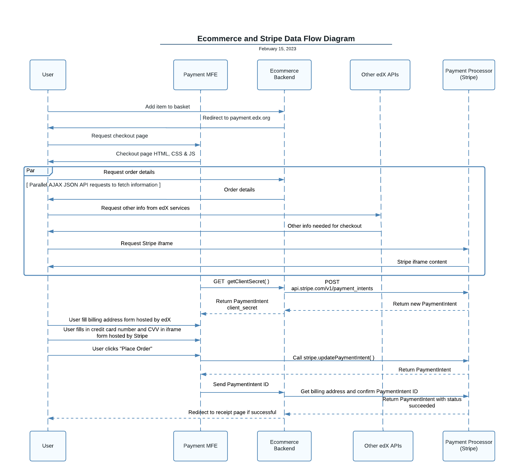

5. Stripe Custom Actions 
========================

Status
------

Draft

.. After acceptance, becomes, for example:

    Accepted (2023-02-01

Context
-------

We have added Stripe as a payment processor suppported by frontend-app-payment.

`Stripe's default payment architecture`_ does not involve a service's backend until after payment. This means a user can pay before the backend service can evaluate the user's billing details.

Our `ecommerce` backend may deny checkout if a user's billing details are on a sanctions list. This is called the `SDN check`_. But for this, ecommerce must be involved before payment.

`Stripe Custom Actions`_ is an alternative architecture that sends payments through a backend before payment. Stripe Custom Actions preserves PCI compliance by sending sensitive financial information to Stripe and not the backend. However, it does not process payment until the payment is confirmed by the backend and allows inspection of non-sensitive billing details by the backend prior to payment.

Stripe Custom Actions also is similar to the architecture of Cybersource's Flex Microform SDK. Both architectures do not involve a pending state for baskets and involve the backend prior to payment. This similarity makes it easier to intially implement Stripe as `BasePaymentProcessor`_ in ecommerce.

.. _Stripe's default payment architecture: https://stripe.com/docs/payments/accept-a-payment?platform=web&ui=elements#web-create-intent
.. _ecommerce: https://github.com/openedx/ecommerce
.. _SDN check: https://github.com/openedx/ecommerce/blob/master/ecommerce/extensions/payment/core/sdn.py#L29
.. _BasePaymentProcessor: https://github.com/openedx/ecommerce/blob/7555353ae972563fd293558eea608ae6151c1186/ecommerce/extensions/payment/processors/__init__.py#L20 

Decision
--------

We will use the architecture in the `Stripe Custom Actions`_ documentation for communication between frontend-app-payment, frontend-app-payment's backend (ecommerce) and Stripe.

.. _Stripe Custom Actions: https://stripe.com/docs/payments/run-custom-actions-before-confirmation

Consequences
------------

When frontend-app-payment loads, it will ask ecommerce for a Stripe ``client_secret`` using ecommerce's endpoint ``/bff/payment/v0/capture_context/``.

When a user submits a purchase, frontend-app-payment will:

#. Send the payment details to Stripe via ``stripe.updatePaymentIntent()``. (As opposed to executing payment via ``stripe.confirmPayment()``, which is what is usually done without Stripe Custom Actions. )

#. Let the ecommerce backend know the user wants to pay using endpoint ``/bff/payment/v0/payment/``. 

This ADR extends ADR `4. iFrame Credit Card Handling`_. Like Cybersource, Stripe simplifies an operator's compliance requirements by sending credit card numbers, expiration dates, verification codes, and other protected data exclusively through a Stripe-hosted iframe. Developers must never collect these data in frontend-app-payment outside of a payment processor's hosted iframe.

In order to use Stripe, operators must:

* Request Stripe to enable custom actions on their Stripe account.

* Create and enable ecommerce waffle flag ``enable_stripe_payment_processor`` to have frontend-app-payment use Stripe instead of Cybersource.

.. _4. iFrame Credit Card Handling: https://github.com/openedx/frontend-app-payment/blob/8387fccfcf781db5170a0f9c1052c6cfc538f7eb/docs/decisions/0004-iframe-credit-card-handling.rst

Implementation
--------------

* Load Stripe.js in `Checkout.jsx <https://github.com/openedx/frontend-app-payment/blob/8387fccfcf781db5170a0f9c1052c6cfc538f7eb/src/payment/checkout/Checkout.jsx#L5>`__

* Fetch client_secret from ecommerce in `Checkout.jsx:componentDidMount() <https://github.com/openedx/frontend-app-payment/blob/8387fccfcf781db5170a0f9c1052c6cfc538f7eb/src/payment/checkout/Checkout.jsx#L28>`__, `service.js <https://github.com/openedx/frontend-app-payment/blob/8387fccfcf781db5170a0f9c1052c6cfc538f7eb/src/payment/data/service.js#L59-L64>`__

* Add enableStripePaymentProcessor prop based on enable_stripe_payment_processor ecommerce waffle flag
 
  * Send waffle flag value in any PaymentApiLogicMixin (e.g. PaymentApiView, QuantityApiView, VoucherAddApiView, VoucherRemoveApiView) in `extensions/basket/views.py <https://github.com/openedx/ecommerce/blob/7555353ae972563fd293558eea608ae6151c1186/ecommerce/extensions/basket/views.py#L747-L750>`__
     
  * Add API payload to Redux state in `reducers.js <https://github.com/openedx/frontend-app-payment/blob/8387fccfcf781db5170a0f9c1052c6cfc538f7eb/src/payment/data/reducers.js#L38>`__

  * Ask React Redux to connect state to props in `PaymentPage.jsx:connect() <https://github.com/openedx/frontend-app-payment/blob/8387fccfcf781db5170a0f9c1052c6cfc538f7eb/src/payment/PaymentPage.jsx#L184>`__

* Split <StripePaymentForm> from (Cybersource) <PaymentForm> since Stripe collects card expiration and Cybersource does not in `StripePaymentForm <https://github.com/openedx/frontend-app-payment/blob/8387fccfcf781db5170a0f9c1052c6cfc538f7eb/src/payment/checkout/payment-form/StripePaymentForm.jsx#L25>`__

* Load <StripePaymentForm> within Stripe.js Elements or (Cybersource) <PaymentForm> based on enableStripePaymentProcessor in `Checkout.jsx <https://github.com/openedx/frontend-app-payment/blob/8387fccfcf781db5170a0f9c1052c6cfc538f7eb/src/payment/checkout/Checkout.jsx#L267-L290>`__

* Create payment processor to submit billing details to Stripe and handle post-payment processing in `stripe/service.js <https://github.com/openedx/frontend-app-payment/blob/8387fccfcf781db5170a0f9c1052c6cfc538f7eb/src/payment/payment-methods/stripe/service.js#L11-L18>`__

Sequence Diagram
----------------

References
----------
* `Stripe Custom Actions`_
* `Stripe PCI Compliance`_

.. _Stripe PCI Compliance: https://stripe.com/docs/security/guide
